# Hybrid Cloud Connectivity: Building HA VPN Between Google Cloud and AWS with BGP Dynamic Routing

This project documents the end-to-end implementation of a **High Availability (HA) VPN** connection between **Google Cloud Platform (GCP)** and **Amazon Web Services (AWS)** using **BGP dynamic routing**. The setup establishes four IPSec tunnels with Equal-Cost Multi-Path (ECMP) routing, enabling resilient and automated cross-cloud connectivity.

## Architecture Overview

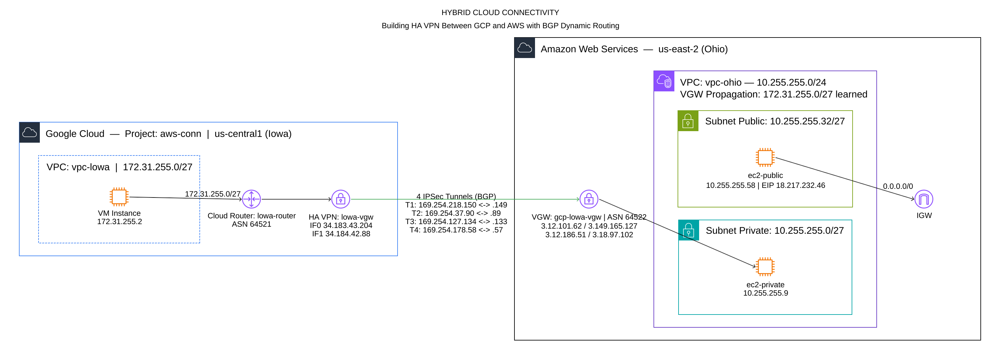

### Environment Summary

| Parameter | GCP | AWS |
|-----------|-----|-----|
| **Region** | `us-central1` (Iowa) | `us-east-2` (Ohio) |
| **VPC** | `vpc-lowa` | `vpc-ohio` |
| **CIDR** | `172.31.255.0/27` | `10.255.255.0/24` |
| **BGP ASN** | `64521` | `64522` |
| **VPN Gateway** | HA VPN (`lowa-vgw`) | Virtual Private Gateway (`gcp-lowa-vgw`) |
| **Tunnels** | 2 VPN connections × 2 tunnels = **4 tunnels (HA)** | |
| **Routing** | Cloud Router (`lowa-router`) | VGW route propagation |

---

## Configuration Steps

### Step 1 — Create the HA VPN Gateway on GCP

Create an HA VPN Gateway in GCP. This gateway automatically provisions **two public IP addresses** (Interface 0 and Interface 1), which are essential for establishing high availability with AWS.

- Navigate to **VPC Network → VPN → Create VPN Connection** in the GCP Console.
- Select **High-availability (HA) VPN** as the gateway type.
- Assign it to your target VPC and region.

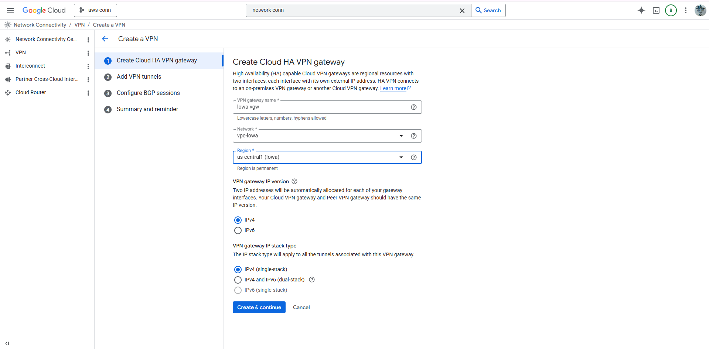

### Step 2 — Create the Cloud Router on GCP

A Cloud Router is required to manage BGP sessions and dynamically exchange routes between GCP and AWS.

- Create a new Cloud Router in the same region as the HA VPN Gateway.
- Assign a **private BGP ASN** (e.g., `64521`).
- Set the route advertisement mode to **Advertise all subnets** so that all VPC routes are automatically shared with AWS.

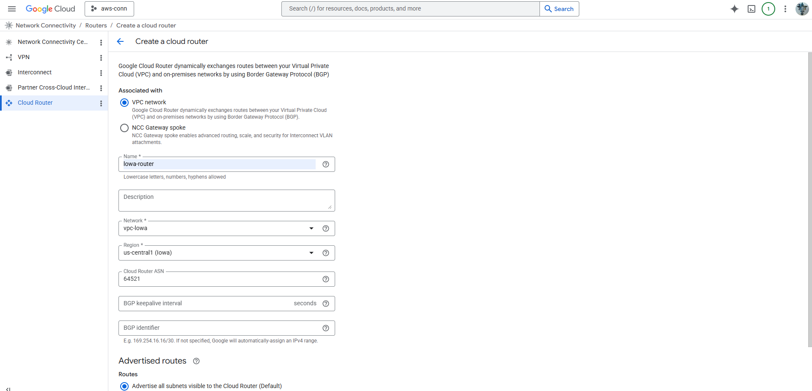

### Step 3 — Create the Virtual Private Gateway (VGW) on AWS

The Virtual Private Gateway serves as the VPN endpoint on the AWS side.

- Navigate to **VPC → Virtual Private Gateways** in the AWS Console.
- Create a new VGW and specify a **custom BGP ASN** (e.g., `64522`).
- **Attach** the VGW to your target VPC.

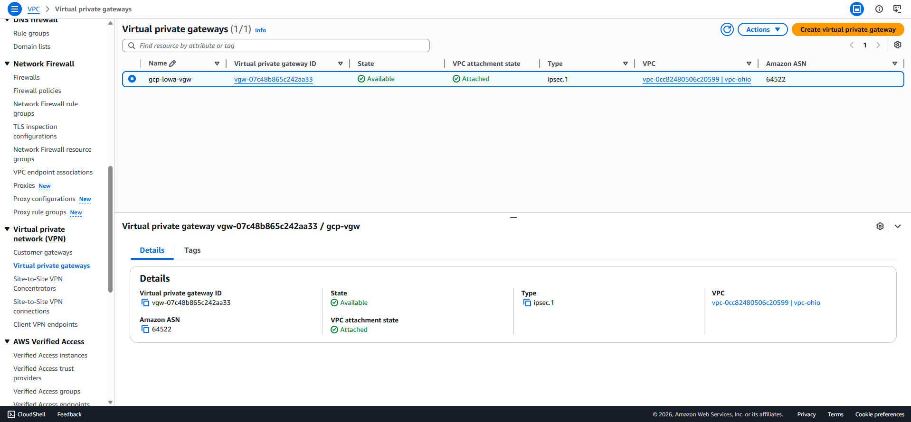

### Step 4 — Create Customer Gateways (CGWs) on AWS

Customer Gateways represent the GCP HA VPN interfaces on the AWS side. Since the HA VPN Gateway has two interfaces, **two CGWs must be created** — one for each GCP public IP.

- **CGW 1:** Enter the public IP of GCP HA VPN Interface 0 and the GCP BGP ASN.
- **CGW 2:** Enter the public IP of GCP HA VPN Interface 1 and the GCP BGP ASN.

| CGW | GCP HA VPN Interface | Public IP |
|-----|----------------------|-----------|
| CGW-1 | Interface 0 | `34.183.43.204` |
| CGW-2 | Interface 1 | `34.184.42.88` |

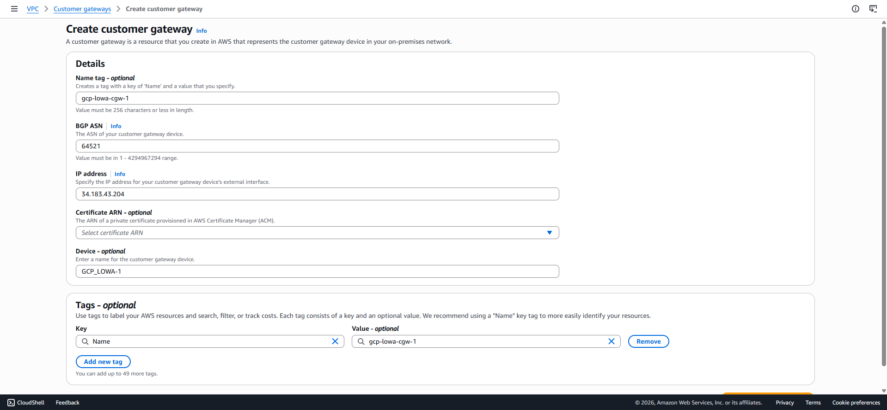
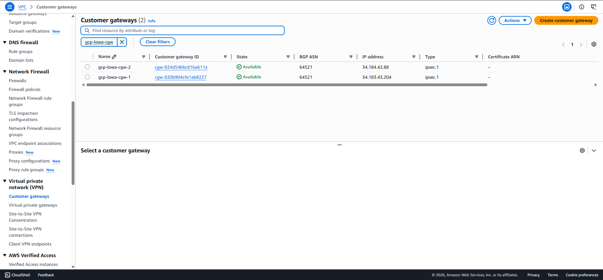

### Step 5 — Establish Site-to-Site VPN Connections on AWS

Create two VPN connections on AWS, each linking the VGW to one of the Customer Gateways. Each VPN connection automatically provisions **two tunnels**, resulting in a total of **four IPSec tunnels** for full HA.

- Set the **Routing Option** to `Dynamic (requires BGP)` to enable automatic route exchange.
- Configure **Pre-Shared Keys (PSKs)** and **Inside CIDR blocks** for each tunnel (these can be auto-generated or manually specified).
- Once the VPN connections are created, **download the configuration file** from the AWS Console using the **"Generic vendor"** option. This file contains the **Pre-Shared Keys** and **BGP inside tunnel IP addresses** that will be required when configuring the VPN tunnels on the GCP side.

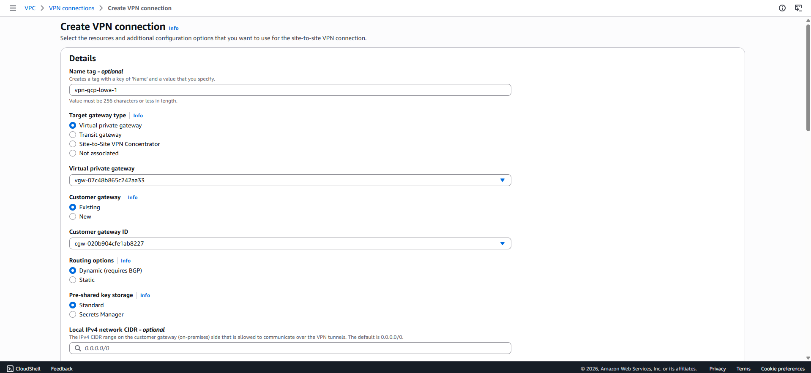
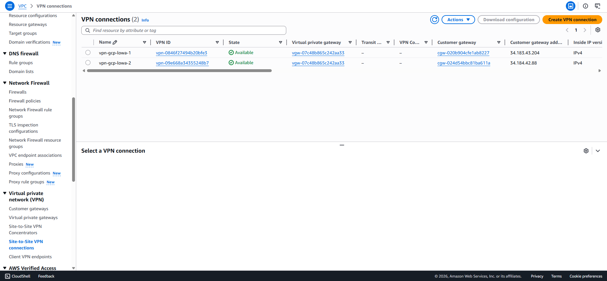

### Step 6 — Configure the Peer VPN Gateway on GCP

On the GCP side, create a **Peer VPN Gateway** that represents the AWS VGW. Enter all four AWS tunnel endpoint IPs obtained from the VPN connection configurations.

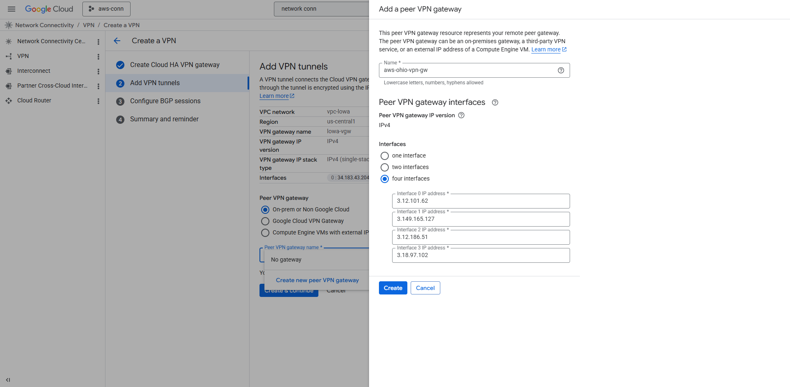

### Step 7 — Create VPN Tunnels and BGP Sessions on GCP

Create four VPN tunnels on GCP, mapping each tunnel to the corresponding AWS endpoint. For each tunnel, configure a **BGP session** using the inside tunnel IP addresses provided in the AWS VPN configuration file.

- Assign the **GCP BGP IP** and **AWS Peer BGP IP** based on the inside CIDR allocations.
- Use the **Pre-Shared Key (PSK)** from the AWS configuration for each tunnel.

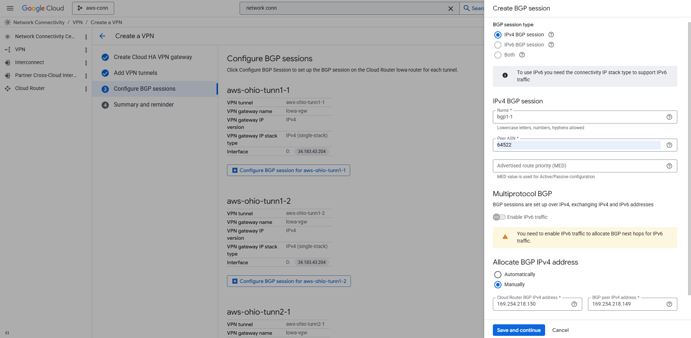
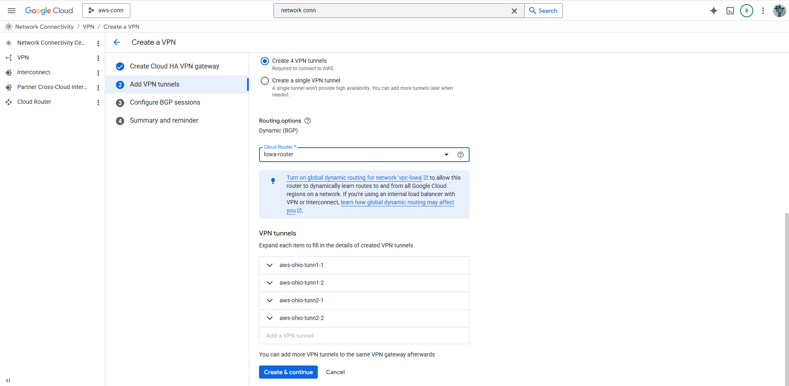

### Step 8 — Update VPC Route Tables on AWS

Enable **VGW route propagation** on the VPC route tables so that routes learned from GCP via BGP are automatically added to the AWS routing tables. This eliminates the need for manual static routes.

- Navigate to **VPC → Route Tables** and select the route table associated with your subnets.
- Enable **Route Propagation** for the Virtual Private Gateway.

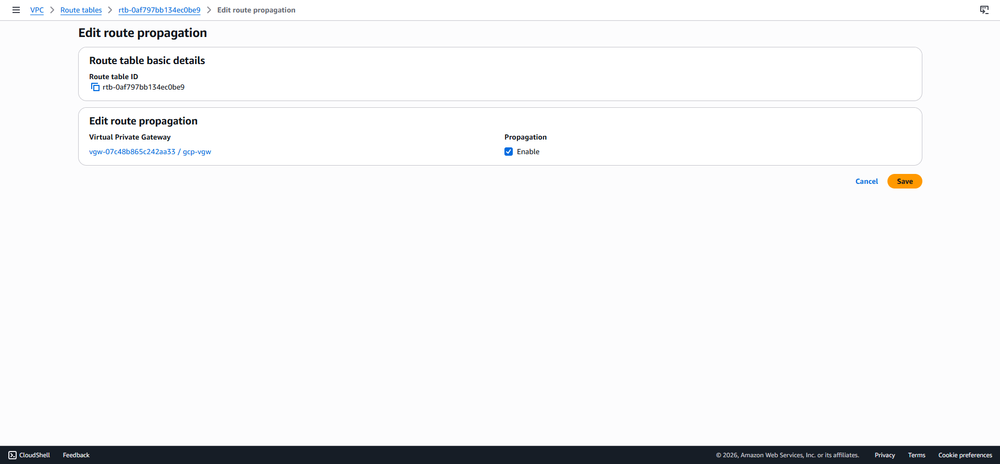

### Step 9 — Adjust Security Groups on AWS

Update the **Security Group** rules attached to your AWS instances to allow inbound traffic from the GCP CIDR block. Without this step, traffic from GCP will be blocked at the instance level even if the VPN tunnels are operational.

- Add an inbound rule allowing the GCP subnet CIDR (e.g., `172.31.255.0/27`) for the required protocols (ICMP, TCP, etc.).

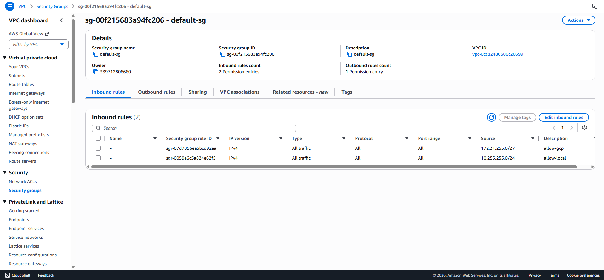

---

## Verification and Testing

### VPN Tunnel and BGP Session Status

After completing the configuration, verify that all four VPN tunnels are **UP** and all BGP sessions are **Established**.

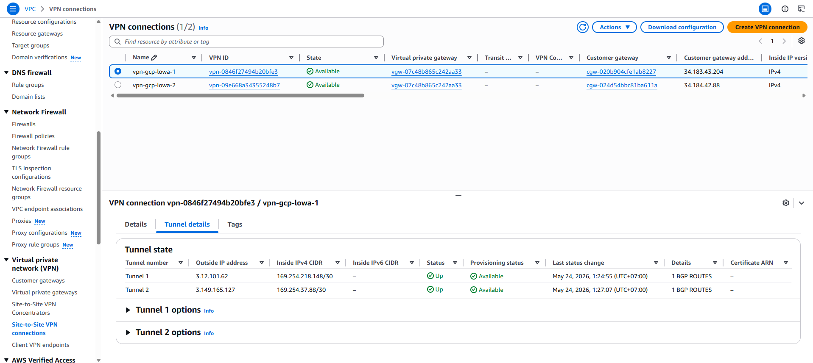
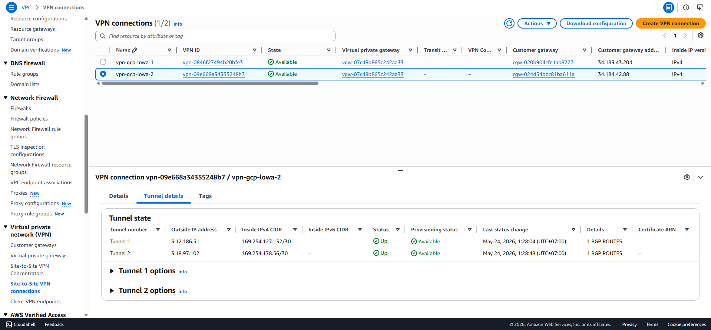
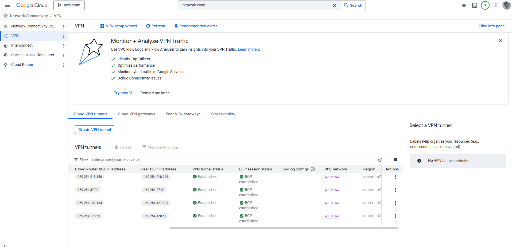

### Route Exchange Verification

Confirm that routes are being exchanged correctly between both clouds via BGP:

- **GCP** should receive the AWS VPC CIDR (`10.255.255.0/24`) from the Cloud Router.
- **AWS** should receive the GCP subnet CIDR (`172.31.255.0/27`) in its route tables via VGW propagation.

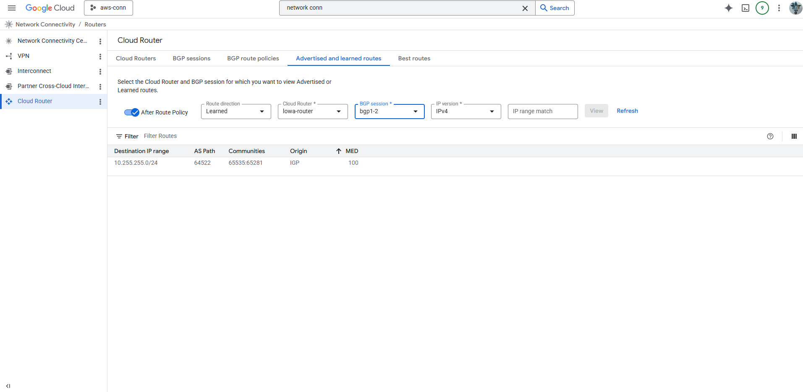
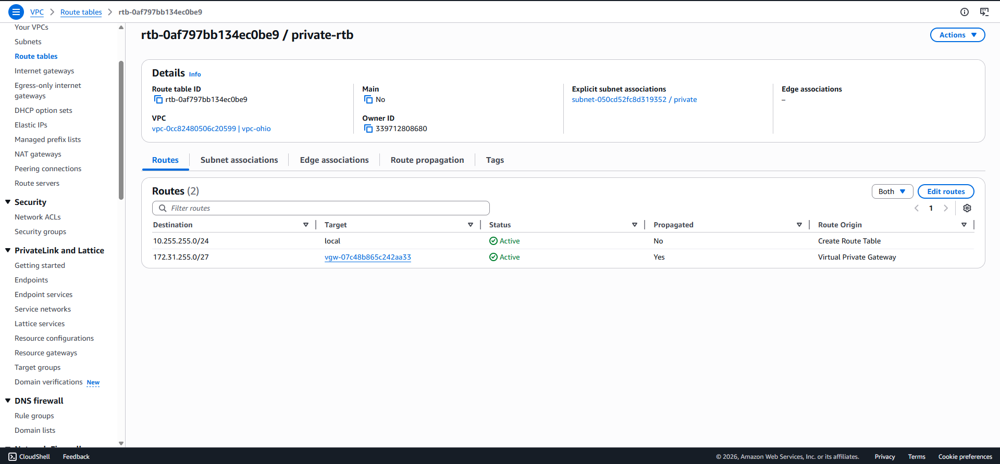

### Connectivity Test

The final validation is an end-to-end connectivity test between a GCP VM instance and an AWS EC2 instance using ICMP ping.

**Before Security Group Fix — Ping Failed:**

The initial ping test from the GCP instance (`172.31.255.2`) to the AWS EC2 instance (`10.255.255.9`) failed because the AWS Security Group was not yet configured to allow inbound traffic from the GCP CIDR.

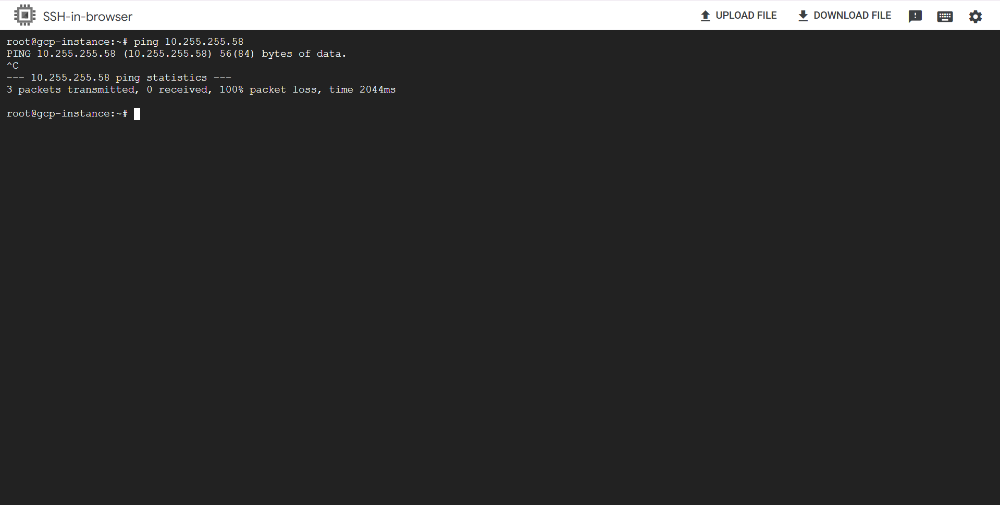

**After Security Group Fix — Ping Successful:**

After updating the Security Group to allow traffic from `172.31.255.0/27`, the ping test succeeded, confirming full cross-cloud connectivity through the HA VPN tunnels.

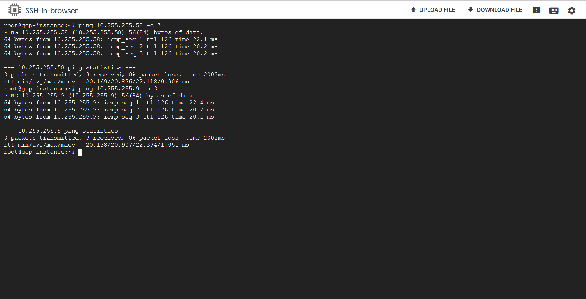

---

## VPN Tunnel Details

### VPN Connection 1: `vpn-gcp-lowa-1`

| Parameter | Tunnel 1 (`aws-ohio-tunn1-1`) | Tunnel 2 (`aws-ohio-tunn1-2`) |
|-----------|-------------------------------|-------------------------------|
| **AWS Outside IP** | `3.12.101.62` | `3.149.165.127` |
| **GCP Outside IP** | `34.183.43.204` | `34.183.43.204` |
| **AWS Inside IP** | `169.254.218.149/30` | `169.254.37.89/30` |
| **GCP Inside IP** | `169.254.218.150/30` | `169.254.37.90/30` |

### VPN Connection 2: `vpn-gcp-lowa-2`

| Parameter | Tunnel 3 (`aws-ohio-tunn2-1`) | Tunnel 4 (`aws-ohio-tunn2-2`) |
|-----------|-------------------------------|-------------------------------|
| **AWS Outside IP** | `3.12.186.51` | `3.18.97.102` |
| **GCP Outside IP** | `34.184.42.88` | `34.184.42.88` |
| **AWS Inside IP** | `169.254.127.133/30` | `169.254.178.57/30` |
| **GCP Inside IP** | `169.254.127.134/30` | `169.254.178.58/30` |

---

## BGP Sessions

| Session | GCP BGP IP | AWS BGP IP | Status |
|---------|------------|------------|--------|
| `bgp1-1` | `169.254.218.150` | `169.254.218.149` | ✅ Established |
| `bgp1-2` | `169.254.37.90` | `169.254.37.89` | ✅ Established |
| `bgp2-1` | `169.254.127.134` | `169.254.127.133` | ✅ Established |
| `bgp2-2` | `169.254.178.58` | `169.254.178.57` | ✅ Established |

---

## Links

Origin : 
- [Origin](https://github.com/andre4freelance/gcp-aws-conn)
- [Linkedin post](https://www.linkedin.com/posts/link-andre-bastian_multicloud-gcp-aws-ugcPost-7464049726284533760-THZ2/?utm_source=share&utm_medium=member_desktop&rcm=ACoAAD73JlUBty-p-mBfMEW0-O4j0sv-e_PRQvc)
- Facebook post